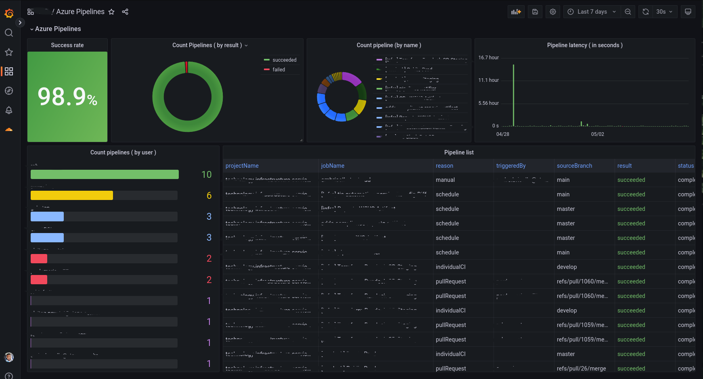

# azure-devops-exporter
A simple Azure Devops Prometheus Exporter.

## Features
- Get information about Azure Devops Project;
- Get Azure Pipelines metrics;

## Metrics
<table>
<tr><td><b>Metric name</b></td><td><b>Description</b></td><td><b>Type</b></td></tr>
<tr><td>azure_devops_build_latency</td><td>Returns build latency</td><td>Gauge</td></tr>
<tr><td>azure_devops_build_status</td><td>Returns build status</td><td>Gauge</td></tr>
<tr><td>azure_devops_pipeline_info</td><td>Returns informations about Project Pipelines </td><td>Gauge</td></tr>
<tr><td>azure_devops_project_info</td><td>Returns information about Azure Devops Project</td><td>Gauge</td></tr>
</table>

## Prerequisites
- Python 3.9+;
- PIP:
  - prometheus-client;
  - requests;
  - pytz;

## Usage
```bash
usage: azure-devops-exporter.py [-h] --pat PAT --org ORG --http-server-port HTTP_SERVER_PORT --scrape-seconds SCRAPE_SECONDS --projects PROJECTS

options:
  -h, --help            show this help message and exit
  --pat PAT             Azure Devops PAT
  --org ORG             Azure DevOps Organization
  --http-server-port HTTP_SERVER_PORT
                        Port to start http-server
  --scrape-seconds SCRAPE_SECONDS
                        Consider events executed at N seconds ago.
  --projects PROJECTS   Project to be scanned
```

### Example
```bash
./azure-devops-exporter.py --pat YOUR_PAT --org=AZ_DEVOPS_ORG --http-server-port=9186 --scrape-seconds=300 --projects="PROJECT_ID_X,PROJECT_ID_Y, PROJECT_ID_Z"
```

### Dashboard example


<a href="grafana/azure-pipelines-dashboard.json">Dashboard JSON</a>

### License

MIT License.